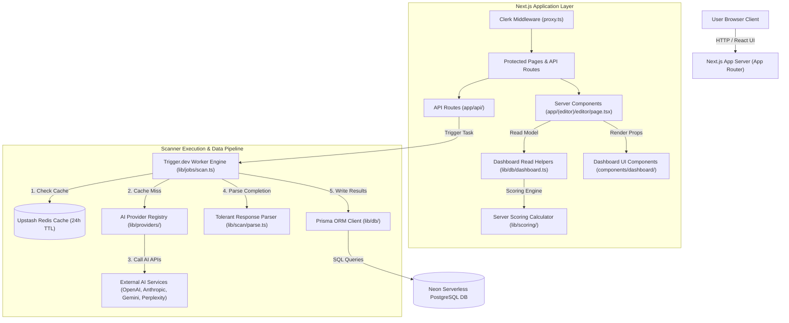
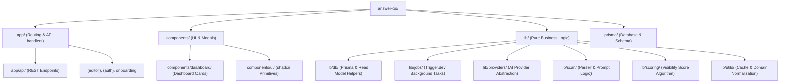
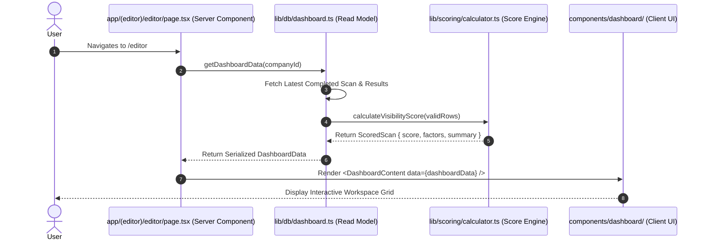
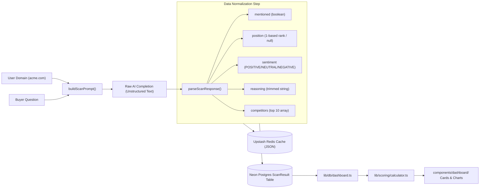
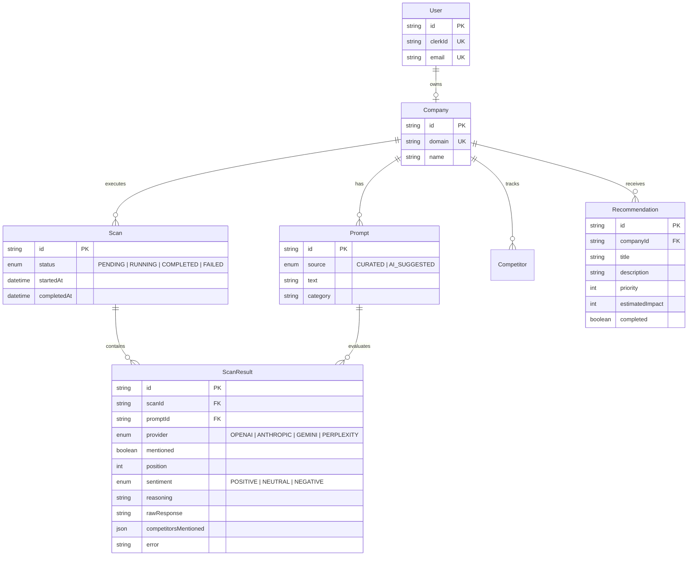

# System Architecture Review: AnswerOS

> [!NOTE]
> **AnswerOS** is an AI Search & Visibility Optimization platform (Answer Engine Optimization / GEO). This document provides a complete high-level system architecture review, detailing how components communicate, database designs, request flows, and codebase navigation.

---

## 1. Start With the Big Picture

### What is this application/system?
**AnswerOS** allows software companies to track how often AI language models (OpenAI ChatGPT, Anthropic Claude, Google Gemini, and Perplexity) recommend their products to prospective software buyers.

### What problem does it solve?
Buyers increasingly ask AI models for software recommendations (e.g., *"What is the best CRM for startups?"*). AnswerOS automates running buyer question prompts against multiple AI providers, extracting structured data (mention, rank position, sentiment, reasoning, and competitors), caching the answers in Redis, persisting visibility metrics to a database, calculating a server-side Visibility Score (0–100), and presenting actionable insights on a server-rendered dashboard workspace.

### Core Technology Stack
- **Frontend & Web Framework:** Next.js 16 (App Router) with React 19, TypeScript, Tailwind CSS v4, and shadcn/ui.
- **Authentication:** Clerk (`@clerk/nextjs`).
- **Database Layer:** PostgreSQL hosted on Neon (Serverless Postgres) with **Prisma v7** ORM (`@prisma/adapter-neon`).
- **Caching Layer:** **Upstash Redis** (`@upstash/redis` via HTTP/REST) for prompt result caching with a 24-hour TTL.
- **Background Worker & Task Queue:** **Trigger.dev v3** (`@trigger.dev/sdk`) background task engine.
- **AI Integration Layer:** Vercel AI SDK (`ai`), wrapping 7 AI providers: Free Tier (`Gemini`, `Groq`, `Nvidia NIM`, `OpenRouter`, `OpenAI`) and Premium Tier (`Anthropic`, `Perplexity`). Supports fallback candidate iteration and tier entitlement checks.
- **Visibility Scoring Engine:** Server-only multi-factor weighted scoring algorithm (`lib/scoring/`).
- **Prompt Opportunity & Management:** Seven buyer-intent taxonomy (`lib/prompts/intent.ts`), Business Profile–grounded AI suggestion generator (`lib/prompts/generator.ts`), server-side Opportunity Score calculator (`lib/scoring/opportunity.ts`), and pre-scan review workspace UI (`app/(editor)/prompts/page.tsx`).

### Architecture Overview Diagram



---

## 2. Explain the Folder Structure

The repository follows a modern Next.js 16 App Router structure with business logic isolated in the [`lib/`](file:///c:/Users/Ryon/Downloads/answer-os/lib) directory:

```
answer-os/
├── app/                  # Next.js App Router pages, layouts, loading skeletons, and REST API endpoints
├── components/           # React UI components (primitives, dashboard panels, dialogs)
├── context/              # Architectural specs and project documentation
├── generated/            # Auto-generated code (Prisma Client output)
├── hooks/                # React state hooks (e.g. useDialogs)
├── lib/                  # Core business logic, DB access, AI abstraction, scoring, and jobs
├── prisma/               # Schema definitions, migrations, and seed scripts
└── trigger.config.ts     # Configuration for Trigger.dev background worker system
```



### Folder Responsibilities

> [!TIP]
> Keeping business logic inside `lib/` (outside of `app/`) ensures that core pipeline tasks can be executed inside background workers or unit-tested without loading Next.js web server context.

- **`app/`**: Defines web pages (`page.tsx`), layouts (`layout.tsx`), route loading skeletons (`loading.tsx`), and REST API endpoint handlers (`route.ts`).
- **`components/dashboard/`**: Presentation component suite for visibility score cards, factor breakdowns, metrics overview, SVG trend graphs, prompt performance, competitor mentions, and recommendations.
- **`lib/db/`**: Data access layer wrapping Prisma query calls into clean helper functions and composing the dashboard read model (`lib/db/dashboard.ts`).
- **`lib/jobs/`**: Background worker definitions executed asynchronously by Trigger.dev.
- **`lib/providers/`**: AI abstraction layer providing a unified interface across 4 different AI vendor SDKs.
- **`lib/scan/`**: Core scan engine modules for building prompt templates and parsing AI completions.
- **`lib/scoring/`**: Pure, server-side core logic (`weights.ts`, `calculator.ts`) for calculating the weighted 0–100 Visibility Score from scan results.
- **`lib/utils/`**: Utility modules including Upstash Redis caching (`cache.ts`) and domain validation (`domain.ts`).

---

## 3. Explain EVERY Important File

### Key File Directory

| File Path | Primary Responsibility | Primary Consumers |
| :--- | :--- | :--- |
| [`prisma/schema.prisma`](file:///c:/Users/Ryon/Downloads/answer-os/prisma/schema.prisma) | Single source of truth for database models & schema. | Prisma Client, DB helpers |
| [`app/api/scans/route.ts`](file:///c:/Users/Ryon/Downloads/answer-os/app/api/scans/route.ts) | HTTP endpoint to validate request and trigger scan jobs. | Frontend modal (`RunScanDialog`) |
| [`lib/jobs/scan.ts`](file:///c:/Users/Ryon/Downloads/answer-os/lib/jobs/scan.ts) | Orchestrates background scan execution loop across prompts & providers. | Trigger.dev Engine |
| [`lib/scan/prompt.ts`](file:///c:/Users/Ryon/Downloads/answer-os/lib/scan/prompt.ts) | Interpolates buyer questions and metadata extraction rules. | Scan Job (`lib/jobs/scan.ts`) |
| [`lib/scan/citations.ts`](file:///c:/Users/Ryon/Downloads/answer-os/lib/scan/citations.ts) | Domain extraction (`extractCitations`) & taxonomy classification (`classifyDomain`: `YOU`, `COMPETITOR`, `CORPORATE`, `EDITORIAL`, `UGC`, `OTHER`). | Scan Job & DB Results |
| [`lib/db/sources.ts`](file:///c:/Users/Ryon/Downloads/answer-os/lib/db/sources.ts) | Aggregates citation records for Donut Chart (`SourceTypeBreakdown`) and Domain Leaderboard (`DomainCitationRow`). | Sources API (`app/api/dashboard/sources/route.ts`) |
| [`app/api/dashboard/sources/route.ts`](file:///c:/Users/Ryon/Downloads/answer-os/app/api/dashboard/sources/route.ts) | REST API endpoint returning top sources breakdown and domain leaderboard data. | Dashboard UI Components |
| [`components/dashboard/top-sources-card.tsx`](file:///c:/Users/Ryon/Downloads/answer-os/components/dashboard/top-sources-card.tsx) | Donut SVG chart visualizer component with center total source counter and category legend. | Dashboard Content |
| [`components/dashboard/sources-domain-table.tsx`](file:///c:/Users/Ryon/Downloads/answer-os/components/dashboard/sources-domain-table.tsx) | Domain citations leaderboard table displaying favicons, `Used (%)`, `Avg. Citations`, and type badges. | Dashboard Content |
| [`lib/scan/parse.ts`](file:///c:/Users/Ryon/Downloads/answer-os/lib/scan/parse.ts) | Extracts & normalizes JSON metadata from unstructured AI responses. | Scan Job (`lib/jobs/scan.ts`) |
| [`lib/scoring/weights.ts`](file:///c:/Users/Ryon/Downloads/answer-os/lib/scoring/weights.ts) | Defines factor weight constants (mention rate 30%, rank 25%, sentiment 20%, competitor share 15%, source authority 10%). | Score Calculator (`lib/scoring/calculator.ts`) |
| [`lib/scoring/calculator.ts`](file:///c:/Users/Ryon/Downloads/answer-os/lib/scoring/calculator.ts) | Pure Prisma-free multi-factor visibility score calculator engine. | DB Scoring Helper (`lib/db/scoring.ts`) |
| [`lib/db/scoring.ts`](file:///c:/Users/Ryon/Downloads/answer-os/lib/db/scoring.ts) | Server-only DB orchestrator to fetch a company's latest completed scan and calculate their score. | Dashboard Read Model (`lib/db/dashboard.ts`) |
| [`lib/db/dashboard.ts`](file:///c:/Users/Ryon/Downloads/answer-os/lib/db/dashboard.ts) | Composes serializable dashboard read model (`DashboardData`) with full Date string conversion. | Server Component (`app/(editor)/editor/page.tsx`) |
| [`components/dashboard/dashboard-content.tsx`](file:///c:/Users/Ryon/Downloads/answer-os/components/dashboard/dashboard-content.tsx) | Client Component boundary managing workspace UI states (No Company, First Scan CTA, Scanning Banner, Full Grid). | Editor Page (`app/(editor)/editor/page.tsx`) |
| [`lib/utils/cache.ts`](file:///c:/Users/Ryon/Downloads/answer-os/lib/utils/cache.ts) | Handles 24-hour Upstash Redis caching over REST HTTP. | Scan Job (`lib/jobs/scan.ts`) |
| [`lib/providers/registry.ts`](file:///c:/Users/Ryon/Downloads/answer-os/lib/providers/registry.ts) | Inspects API key environment variables and returns active AI providers. | Scan Job & Prompt Generator |
| [`lib/db/results.ts`](file:///c:/Users/Ryon/Downloads/answer-os/lib/db/results.ts) | Handles database deletion and batch-creation of `ScanResult` & `ScanResultCitation` rows. | Scan Job (`lib/jobs/scan.ts`) |

---

## 4. Explain How Files Connect

The application enforces a **Layered Architecture**. Data moves sequentially through specialized modules:



---

## 5. Trace a Real Request: Starting a Scan and Rendering Results

When a user initiates a scan, the system splits processing into three distinct phases: **Synchronous API Dispatch**, **Asynchronous Background Processing**, and **Server-Rendered Dashboard Hydration**.

### Detailed Step Trace

1. **User Action:** The user clicks "Start Scan" inside the [`RunScanDialog`](file:///c:/Users/Ryon/Downloads/answer-os/components/dialogs/run-scan-dialog.tsx) component.
2. **Client Dispatch:** [`lib/api/scans.ts`](file:///c:/Users/Ryon/Downloads/answer-os/lib/api/scans.ts) issues an HTTP POST request to `/api/scans`.
3. **Authentication & Guarding:** [`app/api/scans/route.ts`](file:///c:/Users/Ryon/Downloads/answer-os/app/api/scans/route.ts) runs authentication checks via Clerk, sweeps any `PENDING` scans older than 10 minutes to `FAILED`, and verifies no scan is currently active (returning `HTTP 409` if active).
4. **Pending Record Creation:** A `Scan` row with status `PENDING` is created in PostgreSQL.
5. **Background Task Enqueue:** The API handler invokes `tasks.trigger("scan-company", { scanId })` and returns `HTTP 202 Accepted`.
6. **Task Execution:** The Trigger.dev worker engine picks up `runScan` in [`lib/jobs/scan.ts`](file:///c:/Users/Ryon/Downloads/answer-os/lib/jobs/scan.ts):
   - Updates status to `RUNNING`.
   - Clears prior results for idempotency via `deleteScanResults(scanId)`.
   - Loops over configured providers and prompts.
   - Evaluates Redis cache via `getCachedScanResult()`.
   - On miss: formats prompt via [`lib/scan/prompt.ts`](file:///c:/Users/Ryon/Downloads/answer-os/lib/scan/prompt.ts), calls AI via [`lib/providers/`](file:///c:/Users/Ryon/Downloads/answer-os/lib/providers/), parses completion via [`lib/scan/parse.ts`](file:///c:/Users/Ryon/Downloads/answer-os/lib/scan/parse.ts), and writes to cache via `setCachedScanResult()`.
   - Batch-persists results via [`lib/db/results.ts`](file:///c:/Users/Ryon/Downloads/answer-os/lib/db/results.ts).
   - Marks scan status as `COMPLETED`.
7. **Dashboard Render:** Upon page load or refresh, `app/(editor)/editor/page.tsx` calls `getDashboardData(companyId)`, runs the scoring math on valid rows, and renders the dashboard UI cards.

---

## 6. Explain the Data Flow

Data originates from user configurations, undergoes transformation during scanning, lands in persistent storage, and is converted into a view model:



---

## 7. Explain the Database

### Database Architecture
- **Engine:** PostgreSQL hosted on Neon (Serverless Postgres).
- **ORM:** Prisma v7 with `@prisma/adapter-neon` for WebSocket-compatible serverless connection pooling.

### Entity Relationship Diagram (ERD)



---

## 8. Explain APIs

### REST Endpoints Summary

#### `POST /api/scans`
- **Purpose:** Initiates a new background scan job.
- **Auth Required:** Yes (Clerk Session).
- **Response:** `202 Accepted` `{ data: { scanId: "c...", status: "PENDING" } }`.
- **Error Responses:** `401 Unauthorized`, `404 Company Not Found`, `409 Scan In Progress`, `502 Trigger Failure`.

#### `GET /api/domain`
- **Purpose:** Fetches company details for the signed-in user.
- **Auth Required:** Yes.
- **Response:** `200 OK` `{ data: { id, name, domain } }` or `{ data: null }`.

#### `POST /api/domain`
- **Purpose:** Registers or updates user company domain.
- **Request Body:** `{ domain: "acme.com", name: "Acme Inc" }`.

#### `GET /api/prompts`
- **Purpose:** Fetches prompts (curated library + company AI suggestions).

#### `POST /api/prompts/generate`
- **Purpose:** Triggers AI prompt generation for a company during onboarding.

---

## 9. Explain Authentication and Security

> [!IMPORTANT]
> Authentication is strictly enforced on all workspace routes and API handlers. Unauthenticated requests are rejected before hitting database logic.

- **Authentication System:** Managed via `@clerk/nextjs`.
- **Middleware Protection:** Route access is checked at the proxy level (`proxy.ts`). Protected editor routes execute `auth.protect()`.
- **Authorization & Data Isolation:** Data queries enforce company ownership using `getCompanyByClerkId(clerkId)`.
- **Credential Storage:** Secrets (`OPENAI_API_KEY`, `DATABASE_URL`, `UPSTASH_REDIS_REST_TOKEN`) are kept strictly in server-side environment variables (`.env.local`) and are never exposed to browser bundles.

---

## 10. Explain Scalability

### Current Implementation & Capacity
- **Asynchronous Decoupling:** Next.js API handlers respond immediately (< 200ms) by delegating long-running scans to Trigger.dev workers.
- **Connection Pooling:** Serverless Postgres connections are pooled via Neon's WebSocket driver adapter (`@neondatabase/serverless`).
- **HTTP Redis Caching:** Upstash Redis reduces repetitive provider spend for duplicate prompt scans within 24 hours.
- **Server Components:** Dashboard data is aggregated server-side (`app/(editor)/editor/page.tsx`), preventing duplicate API hops.

---

## 11. Architectural Decisions

| Decision | Selected Option | Rationale | Alternatives Considered |
| :--- | :--- | :--- | :--- |
| **Background Processing** | Trigger.dev v3 | Avoids Vercel 15s/60s serverless HTTP execution timeouts during multi-prompt scans. | In-process async background jobs (risk process termination on serverless). |
| **Caching Layer** | Upstash Redis (REST) | HTTP/REST client runs natively in edge and serverless runtime without TCP connection pooling issues. | Standard Redis TCP socket connection (requires managing socket pools). |
| **AI Integration** | Vercel AI SDK | Provides a single unified API wrapper across OpenAI, Anthropic, Gemini, and Perplexity. | Separate vendor SDKs (increases maintenance overhead). |
| **JSON Extraction** | Tolerant Parser | Appending structured JSON rules to text prompts works consistently across all 4 AI providers. | Native JSON mode / Tool calling APIs (not uniformly supported across all providers). |
| **Visibility Score** | Server-side Pure Calculator | Keeps scoring algorithm server-only (Invariant #4) and prevents leaking business logic into browser bundles. | Client-side score math (vulnerable to manipulation and code bloat). |
| **Dashboard UI** | Server-First Read Model | Fetches data directly in Server Component without extra visibility API hops. | Client-side fetching on mount (causes layout shift and extra network latency). |

---

## 12. Important Design Patterns

### 1. Repository / Data Access Helper Pattern
- **Where:** [`lib/db/companies.ts`](file:///c:/Users/Ryon/Downloads/answer-os/lib/db/companies.ts), [`lib/db/prompts.ts`](file:///c:/Users/Ryon/Downloads/answer-os/lib/db/prompts.ts), [`lib/db/results.ts`](file:///c:/Users/Ryon/Downloads/answer-os/lib/db/results.ts), [`lib/db/dashboard.ts`](file:///c:/Users/Ryon/Downloads/answer-os/lib/db/dashboard.ts).
- **Why:** Isolates database queries from API routes, server components, and background workers.

### 2. Provider Abstraction Pattern
- **Where:** [`lib/providers/`](file:///c:/Users/Ryon/Downloads/answer-os/lib/providers/).
- **Why:** Standardizes different vendor APIs behind a single uniform interface (`AIProvider.ask()`).

### 3. Pure Calculation Pattern
- **Where:** [`lib/scoring/calculator.ts`](file:///c:/Users/Ryon/Downloads/answer-os/lib/scoring/calculator.ts).
- **Why:** Completely decouples scoring math from database ORM objects, enabling instant Vitest unit testing without DB mocks.

---

## 13. How to Navigate This Codebase: Beginner Roadmap

1. **`prisma/schema.prisma`**: Read this first to understand core models (`Company`, `Prompt`, `Scan`, `ScanResult`, `Recommendation`).
2. **`lib/scoring/`**: See how the Visibility Score algorithm calculates mention rate, rank decay, sentiment, competitor share, and source authority.
3. **`lib/db/dashboard.ts`**: Learn how database rows are aggregated into the dashboard view model.
4. **`components/dashboard/`**: Explore the card components, progress indicators, and SVG trend chart.
5. **`lib/jobs/scan.ts`**: Understand how background tasks execute scanner loops across AI providers.

---

## 14. Beginner Glossary

- **ORM (Object-Relational Mapping):** A library (like Prisma) that lets you query databases using TypeScript objects instead of raw SQL strings.
- **REST API:** A standardized HTTP protocol for client-server communication using methods like `GET` and `POST`.
- **TTL (Time to Live):** An expiration timeframe for cached keys in Redis (e.g. 86400 seconds / 24 hours).
- **Background Task:** A non-blocking process that executes long-running jobs outside the web request cycle.
- **Idempotency:** A design property ensuring that executing an operation multiple times produces the exact same outcome without side-effects.
- **Server Component:** React component that renders exclusively on the web server before sending HTML to the browser.
