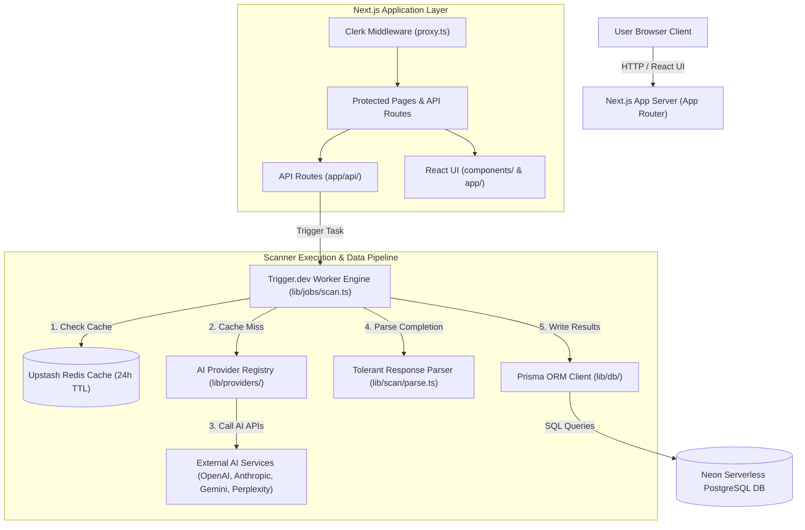
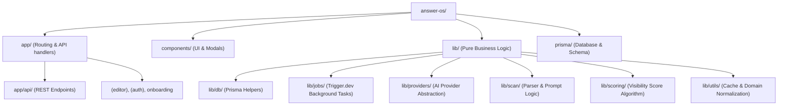
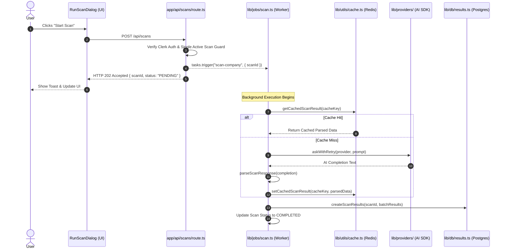
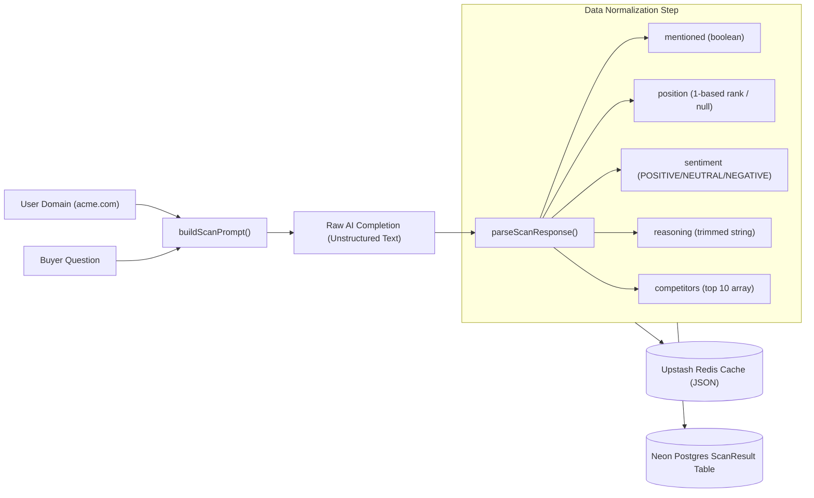
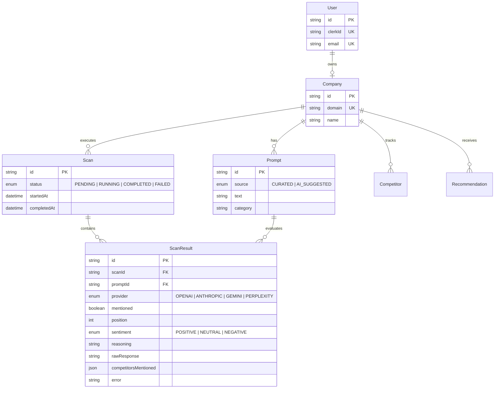
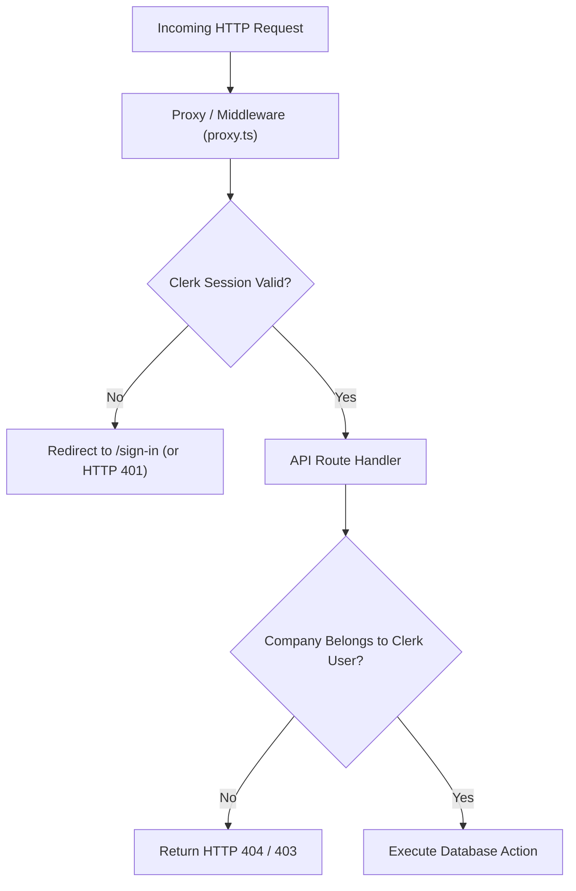
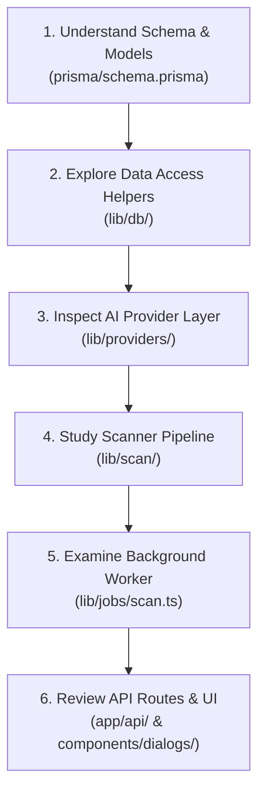

# System Architecture Review: AnswerOS

> [!NOTE]
> **AnswerOS** is an AI Search & Visibility Optimization platform (Answer Engine Optimization / GEO). This document provides a complete high-level system architecture review, detailing how components communicate, database designs, request flows, and codebase navigation.

---

## 1. Start With the Big Picture

### What is this application/system?
**AnswerOS** allows software companies to track how often AI language models (OpenAI ChatGPT, Anthropic Claude, Google Gemini, and Perplexity) recommend their products to prospective software buyers.

### What problem does it solve?
Buyers increasingly ask AI models for software recommendations (e.g., *"What is the best CRM for startups?"*). AnswerOS automates running buyer question prompts against multiple AI providers, extracting structured data (mention, rank position, sentiment, reasoning, and competitors), caching the answers in Redis, and persisting visibility metrics to a database.

### Core Technology Stack
- **Frontend & Web Framework:** Next.js 16 (App Router) with React 19, TypeScript, Tailwind CSS v4, and shadcn/ui.
- **Authentication:** Clerk (`@clerk/nextjs`).
- **Database Layer:** PostgreSQL hosted on Neon (Serverless Postgres) with **Prisma v7** ORM (`@prisma/adapter-neon`).
- **Caching Layer:** **Upstash Redis** (`@upstash/redis` via HTTP/REST) for prompt result caching with a 24-hour TTL.
- **Background Worker & Task Queue:** **Trigger.dev v3** (`@trigger.dev/sdk`) background task engine.
- **AI Integration Layer:** Vercel AI SDK (`ai`), wrapping OpenAI, Anthropic, Gemini, and Perplexity APIs.

### Architecture Overview Diagram



---

## 2. Explain the Folder Structure

The repository follows a modern Next.js 16 App Router structure with business logic isolated in the [`lib/`](file:///c:/Users/Ryon/Downloads/answer-os/lib) directory:

```
answer-os/
├── app/                  # Next.js App Router pages, layouts, and REST API endpoints
├── components/           # React UI components (primitives, layout, dialogs)
├── context/              # Architectural specs and project documentation
├── generated/            # Auto-generated code (Prisma Client output)
├── hooks/                # React state hooks (e.g. useDialogs)
├── lib/                  # Core business logic, DB access, AI abstraction, and jobs
├── prisma/               # Schema definitions, migrations, and seed scripts
└── trigger.config.ts     # Configuration for Trigger.dev background worker system
```



### Folder Responsibilities

> [!TIP]
> Keeping business logic inside `lib/` (outside of `app/`) ensures that core pipeline tasks can be executed inside background workers or unit-tested without loading Next.js web server context.

- **`app/`**: Defines web pages (`page.tsx`), layouts (`layout.tsx`), and REST API endpoint handlers (`route.ts`).
- **`components/`**: Presentation layer separated into shadcn/ui primitives (`components/ui/`), dashboard layout panels (`components/editor/`), and interactive modals (`components/dialogs/`).
- **`lib/db/`**: Data access layer wrapping Prisma query calls into clean helper functions.
- **`lib/jobs/`**: Background worker definitions executed asynchronously by Trigger.dev.
- **`lib/providers/`**: AI abstraction layer providing a unified interface across 4 different AI vendor SDKs.
- **`lib/scan/`**: Core scan engine modules for building prompt templates and parsing AI completions.
- **`lib/scoring/`**: Pure, server-side core logic for calculating the weighted 0–100 Visibility Score from scan results.
- **`lib/utils/`**: Utility modules including Upstash Redis caching (`cache.ts`) and domain validation (`domain.ts`).

---

## 3. Explain EVERY Important File

### Key File Directory

| File Path | Primary Responsibility | Primary Consumers |
| :--- | :--- | :--- |
| [`prisma/schema.prisma`](file:///c:/Users/Ryon/Downloads/answer-os/prisma/schema.prisma) | Single source of truth for database models & schema. | Prisma Client, DB helpers |
| [`app/api/scans/route.ts`](file:///c:/Users/Ryon/Downloads/answer-os/app/api/scans/route.ts) | HTTP endpoint to validate request and trigger scan jobs. | Frontend modal (`RunScanDialog`) |
| [`lib/jobs/scan.ts`](file:///c:/Users/Ryon/Downloads/answer-os/lib/jobs/scan.ts) | Orchestrates background scan execution loop across prompts & providers. | Trigger.dev Engine |
| [`lib/scan/prompt.ts`](file:///c:/Users/Ryon/Downloads/answer-os/lib/scan/prompt.ts) | Interpolates buyer questions and metadata extraction rules. | Scan Job (`lib/jobs/scan.ts`) |
| [`lib/scan/parse.ts`](file:///c:/Users/Ryon/Downloads/answer-os/lib/scan/parse.ts) | Extracts & normalizes JSON metadata from unstructured AI responses. | Scan Job (`lib/jobs/scan.ts`) |
| [`lib/scoring/weights.ts`](file:///c:/Users/Ryon/Downloads/answer-os/lib/scoring/weights.ts) | Defines factor weight constants (mention rate 30%, rank 25%, sentiment 20%, competitor share 15%, source authority 10%). | Score Calculator (`lib/scoring/calculator.ts`) |
| [`lib/scoring/calculator.ts`](file:///c:/Users/Ryon/Downloads/answer-os/lib/scoring/calculator.ts) | Pure Prisma-free multi-factor visibility score calculator engine. | DB Scoring Helper (`lib/db/scoring.ts`) |
| [`lib/db/scoring.ts`](file:///c:/Users/Ryon/Downloads/answer-os/lib/db/scoring.ts) | Server-only DB orchestrator to fetch a company's latest completed scan and calculate their score. | Server Component Dashboard |
| [`lib/utils/cache.ts`](file:///c:/Users/Ryon/Downloads/answer-os/lib/utils/cache.ts) | Handles 24-hour Upstash Redis caching over REST HTTP. | Scan Job (`lib/jobs/scan.ts`) |
| [`lib/providers/registry.ts`](file:///c:/Users/Ryon/Downloads/answer-os/lib/providers/registry.ts) | Inspects API key environment variables and returns active AI providers. | Scan Job & Prompt Generator |
| [`lib/db/results.ts`](file:///c:/Users/Ryon/Downloads/answer-os/lib/db/results.ts) | Handles database deletion and batch-creation of `ScanResult` rows. | Scan Job (`lib/jobs/scan.ts`) |

---

## 4. Explain How Files Connect

The application enforces a **Layered Architecture**. Data moves sequentially through specialized modules:



---

## 5. Trace a Real Request: Starting a Scan

When a user initiates a scan, the system splits processing into two distinct phases: **Synchronous API Dispatch** and **Asynchronous Background Processing**.

### Detailed Step Trace

1. **User Action:** The user clicks "Start Scan" inside the [`RunScanDialog`](file:///c:/Users/Ryon/Downloads/answer-os/components/dialogs/run-scan-dialog.tsx) component.
2. **Client Dispatch:** [`lib/api/scans.ts`](file:///c:/Users/Ryon/Downloads/answer-os/lib/api/scans.ts) issues an HTTP POST request to `/api/scans`.
3. **Authentication & Guarding:** [`app/api/scans/route.ts`](file:///c:/Users/Ryon/Downloads/answer-os/app/api/scans/route.ts) runs authentication checks via Clerk, sweeps any `PENDING` scans older than 10 minutes to `FAILED`, and verifies no scan is currently active (returning `HTTP 409` if active).
4. **Pending Record Creation:** A `Scan` row with status `PENDING` is created in PostgreSQL.
5. **Background Task Enqueue:** The API handler invokes `tasks.trigger("scan-company", { scanId })` and returns `HTTP 202 Accepted`.
6. **Task Execution:** The Trigger.dev worker engine picks up `runScan` in [`lib/jobs/scan.ts`](file:///c:/Users/Ryon/Downloads/answer-os/lib/jobs/scan.ts):
   - Updates status to `RUNNING`.
   - Clears prior results for idempotency via `deleteScanResults(scanId)`.
   - Loops over configured providers and prompts.
   - Evaluates Redis cache via `getCachedScanResult()`.
   - On miss: formats prompt via [`lib/scan/prompt.ts`](file:///c:/Users/Ryon/Downloads/answer-os/lib/scan/prompt.ts), calls AI via [`lib/providers/`](file:///c:/Users/Ryon/Downloads/answer-os/lib/providers/), parses completion via [`lib/scan/parse.ts`](file:///c:/Users/Ryon/Downloads/answer-os/lib/scan/parse.ts), and writes to cache via `setCachedScanResult()`.
   - Batch-persists results via [`lib/db/results.ts`](file:///c:/Users/Ryon/Downloads/answer-os/lib/db/results.ts).
   - Marks scan status as `COMPLETED`.

---

## 6. Explain the Data Flow

Data originates from user configurations, undergoes transformation during scanning, and lands in persistent storage:



---

## 7. Explain the Database

### Database Architecture
- **Engine:** PostgreSQL hosted on Neon (Serverless Postgres).
- **ORM:** Prisma v7 with `@prisma/adapter-neon` for WebSocket-compatible serverless connection pooling.

### Entity Relationship Diagram (ERD)



---

## 8. Explain APIs

### REST Endpoints Summary

#### `POST /api/scans`
- **Purpose:** Initiates a new background scan job.
- **Auth Required:** Yes (Clerk Session).
- **Response:** `202 Accepted` `{ data: { scanId: "c...", status: "PENDING" } }`.
- **Error Responses:** `401 Unauthorized`, `404 Company Not Found`, `409 Scan In Progress`, `502 Trigger Failure`.

#### `GET /api/domain`
- **Purpose:** Fetches company details for the signed-in user.
- **Auth Required:** Yes.
- **Response:** `200 OK` `{ data: { id, name, domain } }` or `{ data: null }`.

#### `POST /api/domain`
- **Purpose:** Registers or updates user company domain.
- **Request Body:** `{ domain: "acme.com", name: "Acme Inc" }`.

#### `GET /api/prompts`
- **Purpose:** Fetches prompts (curated library + company AI suggestions).

#### `POST /api/prompts/generate`
- **Purpose:** Triggers AI prompt generation for a company during onboarding.

---

## 9. Explain Authentication and Security

> [!IMPORTANT]
> Authentication is strictly enforced on all workspace routes and API handlers. Unauthenticated requests are rejected before hitting database logic.



- **Authentication System:** Managed via `@clerk/nextjs`.
- **Middleware Protection:** Route access is checked at the proxy level (`proxy.ts`). Protected editor routes execute `auth.protect()`.
- **Authorization & Data Isolation:** Data queries enforce company ownership using `getCompanyByClerkId(clerkId)`.
- **Credential Storage:** Secrets (`OPENAI_API_KEY`, `DATABASE_URL`, `UPSTASH_REDIS_REST_TOKEN`) are kept strictly in server-side environment variables (`.env.local`) and are never exposed to browser bundles.

---

## 10. Explain Scalability

### Current Implementation & Capacity
- **Asynchronous Decoupling:** Next.js API handlers respond immediately (< 200ms) by delegating long-running scans to Trigger.dev workers.
- **Connection Pooling:** Serverless Postgres connections are pooled via Neon's WebSocket driver adapter (`@neondatabase/serverless`).
- **HTTP Redis Caching:** Upstash Redis reduces repetitive provider spend for duplicate prompt scans within 24 hours.

### Growth Bottlenecks & Scaling Roadmap
1. **Per-Prompt Loop Parallelization:** The current scanner loops sequentially over prompts. For large prompt catalogs (e.g. 500+ prompts), inner loops will be updated to parallel execution or fan-out sub-tasks via Trigger.dev batching (`batchTriggerAndWait`).
2. **Read Path Caching:** Dashboard queries will read from Redis cached scan results before querying database rows.

---

## 11. Architectural Decisions

| Decision | Selected Option | Rationale | Alternatives Considered |
| :--- | :--- | :--- | :--- |
| **Background Processing** | Trigger.dev v3 | Avoids Vercel 15s/60s serverless HTTP execution timeouts during multi-prompt scans. | In-process async background jobs (risk process termination on serverless). |
| **Caching Layer** | Upstash Redis (REST) | HTTP/REST client runs natively in edge and serverless runtime without TCP connection pooling issues. | Standard Redis TCP socket connection (requires managing socket pools). |
| **AI Integration** | Vercel AI SDK | Provides a single unified API wrapper across OpenAI, Anthropic, Gemini, and Perplexity. | Separate vendor SDKs (increases maintenance overhead). |
| **JSON Extraction** | Tolerant Parser | Appending structured JSON rules to text prompts works consistently across all 4 AI providers. | Native JSON mode / Tool calling APIs (not uniformly supported across all providers). |

---

## 12. Important Design Patterns

### 1. Repository / Data Access Helper Pattern
- **Where:** [`lib/db/companies.ts`](file:///c:/Users/Ryon/Downloads/answer-os/lib/db/companies.ts), [`lib/db/prompts.ts`](file:///c:/Users/Ryon/Downloads/answer-os/lib/db/prompts.ts), [`lib/db/results.ts`](file:///c:/Users/Ryon/Downloads/answer-os/lib/db/results.ts).
- **Why:** Isolates database queries from API routes and background workers.
- **Analogy:** Like a warehouse manager who retrieves items when given an SKU, so salespeople don't need to search the shelves themselves.

### 2. Provider Abstraction Pattern
- **Where:** [`lib/providers/`](file:///c:/Users/Ryon/Downloads/answer-os/lib/providers/).
- **Why:** Standardizes different vendor APIs behind a single uniform interface (`AIProvider.ask()`).
- **Analogy:** Universal power adapters that allow standard plugs to connect to foreign outlets.

### 3. Retry Idempotency Pattern
- **Where:** [`lib/jobs/scan.ts`](file:///c:/Users/Ryon/Downloads/answer-os/lib/jobs/scan.ts) (`deleteScanResults(scanId)`).
- **Why:** Ensures that if a background worker retries after a failure, partial results are cleared so database rows are never duplicated.

---

## 13. How to Navigate This Codebase: Beginner Roadmap



1. **`prisma/schema.prisma`**: Read this first to understand core models (`Company`, `Prompt`, `Scan`, `ScanResult`).
2. **`lib/db/`**: See how database operations are encapsulated into helper functions.
3. **`lib/providers/`**: Understand how AI models are instantiated and called.
4. **`lib/scan/`**: Learn how prompts are built and parsed.
5. **`lib/jobs/scan.ts`**: See how everything comes together inside a background task.
6. **`app/api/` & `components/`**: Explore the HTTP APIs and user interface forms.

---

## 14. Complete Dependency Map

```
app/ (Routes & Pages)
  ├── app/api/scans/route.ts
  │     ├── lib/db/companies.ts
  │     └── @trigger.dev/sdk
  └── components/dialogs/run-scan-dialog.tsx
        └── lib/api/scans.ts

lib/ (Business Logic Core)
  ├── lib/jobs/scan.ts (Background Task)
  │     ├── lib/db/prompts.ts
  │     ├── lib/db/results.ts
  │     ├── lib/providers/registry.ts
  │     ├── lib/scan/prompt.ts
  │     ├── lib/scan/parse.ts
  │     └── lib/utils/cache.ts
  │
  ├── lib/utils/cache.ts ──► @upstash/redis
  └── lib/db/*.ts ──► lib/db/prisma.ts ──► @prisma/client ──► Neon PostgreSQL
```

---

## 15. What Happens When You Make Changes

### Example A: Adding a new field to `ScanResult` (e.g. `confidenceScore`)
1. **Schema:** Edit `model ScanResult` in [`prisma/schema.prisma`](file:///c:/Users/Ryon/Downloads/answer-os/prisma/schema.prisma).
2. **Migration:** Run `npx prisma migrate dev --name add_confidence_score` and `npx prisma generate`.
3. **Parser:** Update `ParsedScanResponse` interface and extraction in [`lib/scan/parse.ts`](file:///c:/Users/Ryon/Downloads/answer-os/lib/scan/parse.ts).
4. **DB Helpers:** Update `ScanResultInput` interface in [`lib/db/results.ts`](file:///c:/Users/Ryon/Downloads/answer-os/lib/db/results.ts).
5. **Worker Task:** Pass the parsed score to `ScanResultInput` in [`lib/jobs/scan.ts`](file:///c:/Users/Ryon/Downloads/answer-os/lib/jobs/scan.ts).

### Example B: Adding a new REST API endpoint (`GET /api/scans/[id]`)
1. Create `app/api/scans/[id]/route.ts`.
2. Add auth validation (`await auth()`).
3. Query Prisma DB (`prisma.scan.findUnique(...)`).
4. Return JSON envelope (`NextResponse.json({ data: scan })`).

---

## 16. Potential Issues & Architectural Strengths

### Architectural Strengths
- **Isolated Core Logic:** Prompt building and response parsing modules are pure functions with co-located Vitest unit tests (`npm test`).
- **Resilient Caching:** Redis operations fall back gracefully if caching credentials are not configured.
- **Automatic Recovery:** Stale `PENDING` scans are swept automatically to prevent UI deadlocks.

### Areas to Monitor as Scale Increases
- **Sequential Prompt Loop:** Inner scanner loop can be updated to parallel execution when scanning hundreds of prompts per run.

---

## 17. Beginner Glossary

- **ORM (Object-Relational Mapping):** A library (like Prisma) that lets you query databases using TypeScript objects instead of raw SQL strings.
- **REST API:** A standardized HTTP protocol for client-server communication using methods like `GET` and `POST`.
- **TTL (Time to Live):** An expiration timeframe for cached keys in Redis (e.g. 86400 seconds / 24 hours).
- **Background Task:** A non-blocking process that executes long-running jobs outside the web request cycle.
- **Idempotency:** A design property ensuring that executing an operation multiple times produces the exact same outcome without side-effects.

---

## 18. Final Summary

### 10 Core Concepts of AnswerOS
1. Built on Next.js 16 App Router with React 19 & Tailwind CSS v4.
2. PostgreSQL on Neon stores data; Prisma v7 manages queries.
3. Upstash Redis caches prompt answers for 24 hours over HTTP.
4. AI providers (OpenAI, Anthropic, Gemini, Perplexity) are unified under `lib/providers/`.
5. Background scans run asynchronously via Trigger.dev (`lib/jobs/scan.ts`).
6. Authentication & user isolation are managed by Clerk (`@clerk/nextjs`).
7. `lib/scan/prompt.ts` formats buyer questions into structured evaluation prompts.
8. `lib/scan/parse.ts` extracts rank position, sentiment, reasoning, and competitors from AI text responses.
9. Stale pending scan jobs are automatically recovered after 10 minutes.
10. Application code is organized into pure logic modules, data access helpers, API handlers, and background tasks.

### Recommended Learning Sequence
1. [`prisma/schema.prisma`](file:///c:/Users/Ryon/Downloads/answer-os/prisma/schema.prisma) — Understand the domain entity structure.
2. [`lib/db/`](file:///c:/Users/Ryon/Downloads/answer-os/lib/db/) — Learn how data access is encapsulated.
3. [`lib/scan/`](file:///c:/Users/Ryon/Downloads/answer-os/lib/scan/) — See how prompt building and response parsing work.
4. [`lib/jobs/scan.ts`](file:///c:/Users/Ryon/Downloads/answer-os/lib/jobs/scan.ts) — Understand how background tasks execute scanner loops.
5. [`app/api/scans/route.ts`](file:///c:/Users/Ryon/Downloads/answer-os/app/api/scans/route.ts) — Learn how HTTP requests trigger background worker execution.
